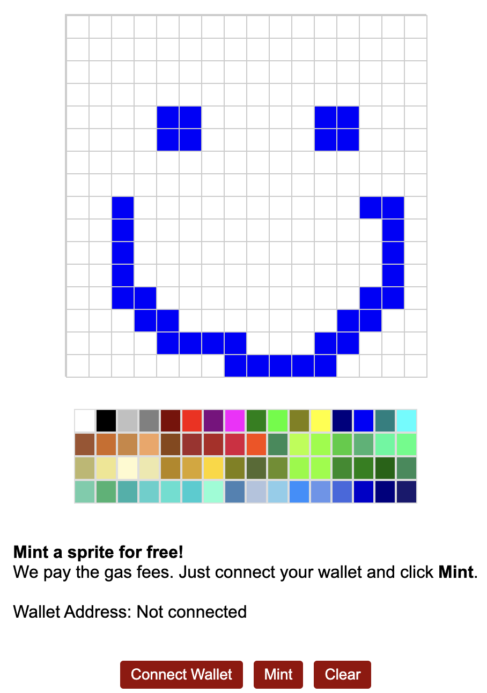

# Sprite Write!
_A MultiBaas Sample DApp_



## Overview
This sample decentralized application (DApp) demonstrates a few key DApp concepts, as well as how to interface with MultiBaas blockchain middleware from via both a DApp frontend and backend using the MultiBaas Typescript and Go SDKs, respectively. The SDKs wraps MultiBaas' full REST APIs

This DApp can be used as a learning tool and starting point to build more complete DApps.

This sample DApp demonstrates includes:
- Frontend: HTML/CSS/Typescript web app that interfaces with MultiBaas via the MultiBaas TypeScript SDK
   - Interact with smart contract functions
   - Retrieve aggregated smart contract event logs via MultiBaas' Event Query functionality
- Backend: Go app that interfaces with MultiBaas via the MultiBaas Go SDK
   - Mint NFTs via an HSM custodial wallet
- Blockchain: Solidity NFT smart contract
   - On-chain storage and SVG rendering of sprite NFTs
   - RBAC, Ownable, and total supply extended functionality
   - ERC2981 royalties
   - OpenSea Filter Registry

## Running the DApp

### Setup a MultiBaas deployment
Create a MultiBaas deployment on your favourite blockchain network by heading over to [curvegrid.com](https://www.curvegrid.com/) and clicking _Get Started_ at the top.

Once the MultiBaas deployment is ready, you can login and use it to generate the required API keys, manage users, configure settings, and interact with the smart contract.

### Blockchain
Change into the `blockchain` directory and install dependencies.

```sh
cd blockchain
nvm use  # requires node 16
yarn install
```

Copy the deployment configuration template to a new file, and fill out the required fields.

```sh
cp deployment-config.template.js deployment-config.testing.js

# open deployment-config.testing.js in your favourite editor and fill in the required fields
vim deployment-config.testing.js
```

Deploy the sample smart contract to the blockchain and, via the [MultiBaas Hardhat Plugin](https://www.npmjs.com/package/hardhat-multibaas-plugin), automatically configure it in MultiBaas as well.

```sh
yarn deploy:spritewrite:testing
```

You can now see and interact with the smart contract in the MultiBaas web UI, and via the [MultiBaas REST API](https://docs.curvegrid.com/multibaas/) and SDKs.

### Backend
Ensure that the [Go programming language is installed](https://go.dev/doc/install).

Change into the `backend` directory and setup the required configuration file.

```sh
cd backend

# copy the template configuration file
cp spritewrite.template.json spritewrite.json

# open spritewrite.json in your favourite editor and fill in the required fields
vim spritewrite.json
```

Build and run the backend.

```sh
go run .
```

### Frontend
Change into the `frontend` directory and install dependencies.

```sh
cd frontend
yarn install
```

Setup the required configuration file. **ENSURE THAT THE API KEY ONLY HAS DAPP USER PERMISSIONS AS IT WILL BE EMBEDDED INTO YOUR FRONTEND AND VISIBLE TO ANYONE WHO DIGS THROUGH YOUR CODE IN THEIR WEB BROWSER DEVELOPMENT TOOLS.**

```sh
# copy the template configuration file
cp spritewrite.template.json spritewrite.json

# open spritewrite.json in your favourite editor and fill in the required fields
vim spritewrite.json
```

Start the frontend.

```sh
yarn build
yarn start
```

Browse to http://localhost:1234 and try out Sprite Write!
